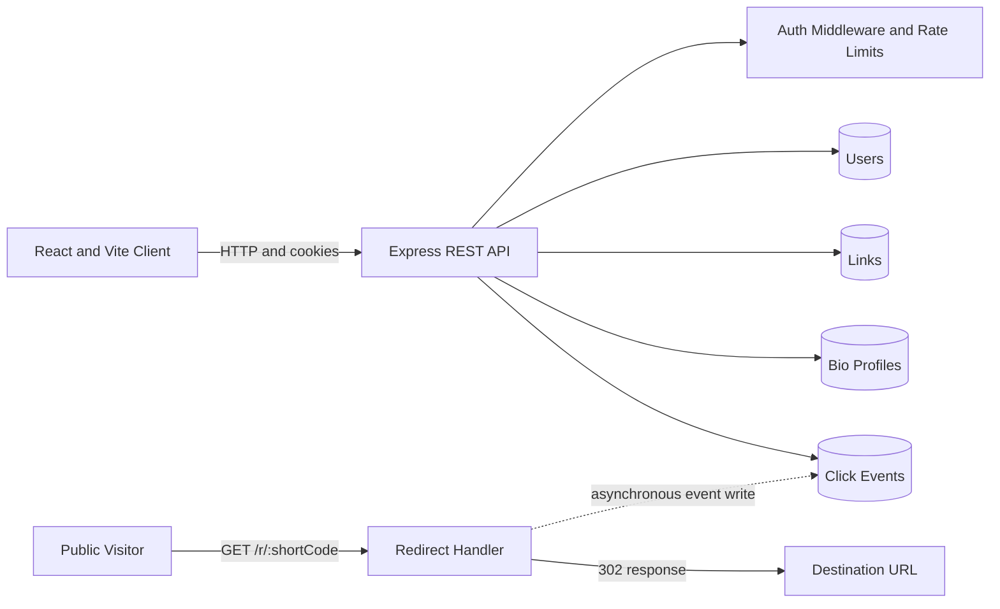

# Branded Short-Link and Bio-Link Hub

A full-stack MERN application that combines branded URL shortening, click analytics, QR code generation, and a customizable public link-in-bio profile in one focused workspace.

The project was built to demonstrate practical full-stack engineering: secure authentication, MongoDB data modeling, protected APIs, responsive React UI, asynchronous event logging, rate limiting, and a clean local development workflow.

## Product Overview

Creators, developers, and small teams often use separate tools for short links, campaign tracking, and social profile links. This application brings those workflows together:

- Create short links with generated codes or custom vanity slugs.
- Track clicks by date, referrer, device type, and link.
- Generate QR codes for sharing links offline.
- Build a public, mobile-friendly bio page with social links and themes.
- Manage links and profile content from an authenticated dashboard.

## Problem Statement

Sharing a creator's work usually requires multiple disconnected tools: one service for short URLs, another for campaign analytics, and another for a social profile landing page. This creates three practical problems:

1. **Fragmented workflow:** link creation, profile management, and performance tracking are handled in different places.
2. **Limited brand control:** generic short URLs and profile pages do not provide a consistent identity or memorable vanity slugs.
3. **Weak operational visibility:** teams cannot easily understand which links are generating traffic, where visitors are coming from, or which devices they use.

The goal of this project was to build one secure, responsive platform that solves these problems while meeting the Project Brief 04 requirements for a Bitly and Linktree hybrid.

## Solution Approach

The solution is organized around three connected workflows:

### 1. Create and Share

An authenticated user creates a short link by entering a destination URL, title, category, and optional vanity slug. The API validates the URL, prevents slug collisions, and generates a clean six-character code when no custom slug is supplied. The user can then copy the link, share it, or generate a QR code.

### 2. Redirect and Measure

Public visitors use `/r/:shortCode`. The server finds the active link, sends a `302` redirect, and records click metadata asynchronously. This keeps the redirect path independent from the analytics write while still providing useful reporting data.

### 3. Build a Public Identity

The same account can configure a public `/bio/:username` page with an avatar, display name, biography, social links, and visual theme. This gives creators a branded destination for their complete online presence.

## Evaluation Brief Alignment

| Evaluation requirement | Implemented solution | Relevant code |
| --- | --- | --- |
| Pair-token authentication | Fifteen-minute access token and seven-day refresh token in `httpOnly` cookies, with refresh rotation | `server/utils/tokens.js`, `server/routes/auth.js` |
| Signup and account recovery | Signup, simulated email verification, forgot-password, and reset-password flows | `server/routes/auth.js` |
| Six-character short links | Unique alphanumeric code generation with duplicate checking | `server/routes/links.js` |
| Custom vanity slugs | User-defined aliases with validation and conflict responses | `server/routes/links.js`, `server/utils/validators.js` |
| Fast redirect endpoint | Public `GET /r/:shortCode` returns `302` and logs telemetry asynchronously | `server/server.js` |
| Click analytics | Timestamp, referrer, device type, hashed IP, and MongoDB aggregation summaries | `server/models/ClickEvent.js`, `server/routes/links.js` |
| Link library | Protected management table with search, pagination, copy, QR, edit, and archive actions | `client/src/main.jsx`, `server/routes/links.js` |
| Link-in-bio hub | Profile editor and public responsive route with themes and social links | `client/src/main.jsx`, `server/routes/bio.js` |
| Abuse protection | Rate limiting on authentication, link creation, and redirects | `server/middleware/rateLimits.js` |
| UI component standard | Local reusable Button, Card, Input, Badge, and form primitives following the copy-and-own Coss UI approach | `client/src/components/ui/` |
| Repository deliverables | Environment template, API documentation, requirements traceability, seed scripts, and setup instructions | `.env.example`, `docs/`, `README.md` |

## User Journey

```text
Sign up
  -> Receive simulated verification token
  -> Configure bio profile
  -> Create a branded short link
  -> Share link or QR code
  -> Visitors are redirected and click metadata is captured
  -> Review analytics and update links from the dashboard
```

## Additional Features Beyond the Core Brief

The implementation also includes supporting features that make the required workflows more usable:

- Search and pagination for a growing link library.
- Link categories and sorting for campaign organization.
- Soft deletion that disables archived redirects without destroying historical records.
- Branded inactive-link error page for removed or unknown slugs.
- Link preview and direct redirect testing from the dashboard.
- Clipboard copy, Web Share API support, and downloadable QR images.
- Light and dark dashboard appearance modes.
- Password visibility controls and client-side password-strength feedback.
- MongoDB health reporting through `/api/health`, including a `503` response when the database is unavailable.
- Development root redirect from port `5000` to the Vite client on port `5173`.

## Core Capabilities

### Link Management

- Automatic six-character alphanumeric short-code generation.
- Custom vanity slugs with duplicate detection.
- URL validation and protocol normalization.
- Link search, pagination, editing, copying, sharing, and soft deletion.
- QR code generation as a downloadable PNG data URL.
- Public `302` redirects through `/r/:shortCode`.

### Analytics

- Total click count and clicks over time.
- Top referrers.
- Device distribution for mobile, desktop, tablet, and other clients.
- Optional analytics filtering for an individual link.
- Asynchronous click-event persistence so redirect responses do not wait for analytics writes.
- SHA-256 hashing of client IP addresses instead of storing raw IP addresses.

### Authentication and Account Security

- Signup, login, logout, email-verification simulation, and password recovery simulation.
- Short-lived access JWT and longer-lived refresh JWT.
- `httpOnly` cookie-based authentication.
- Refresh-token rotation with only a hash stored in MongoDB.
- Protected routes through reusable authentication middleware.
- Rate limiting for authentication, link creation, and redirect traffic.
- Password hashing with `bcryptjs`.

### Bio-Link Profiles

- Public profile route at `/bio/:username`.
- Avatar, display name, biography, and social-link management.
- Responsive mobile-first public page.
- Profile themes including minimal light, dark slate, gradient, and cyber neon.

## Technical Stack

| Layer | Technology |
| --- | --- |
| Frontend | React 19, Vite, Lucide React |
| Backend | Node.js, Express 5 |
| Database | MongoDB with Mongoose |
| Authentication | JWT access and refresh tokens, `httpOnly` cookies |
| Security | bcryptjs, CORS, cookie-parser, express-rate-limit |
| Analytics | MongoDB aggregation, UAParser, SHA-256 IP hashing |
| Utilities | nanoid, qrcode, dotenv |

## Architecture



### Project Structure

```text
client/
  src/
    components/ui/      Reusable UI primitives
    main.jsx            React application and dashboard views
    styles.css          Application styling and responsive layout

server/
  models/               Mongoose schemas
  routes/               Auth, link, and bio APIs
  middleware/           Authentication and rate limiting
  utils/                Tokens, validation, and click metadata
  server.js             Express application and startup
  seed.js               Basic demo data
  demoData.js           Expanded demo data

docs/
  API.md               Endpoint reference
  REQUIREMENTS.md      Requirement-to-implementation mapping
```

## Data Model

### User

Stores account identity and authentication state in the `users` collection.

- Name, email, and unique username.
- bcrypt password hash; never the plain-text password.
- Email-verification state and temporary recovery fields.
- Hash of the current refresh token.
- Automatic `createdAt` and `updatedAt` timestamps.

### Link

Stores a user's destination URLs, short codes, titles, tags, and archive state. Owner and short-code lookups are indexed for common dashboard and redirect queries.

### ClickEvent

Stores link ownership, timestamp, referrer, device type, and hashed IP metadata. Analytics endpoints aggregate these events by time, referrer, device, and link.

### BioProfile

Stores the public profile associated with a user, including display name, biography, avatar, theme, and social links.

## Request Flow: Short-Link Redirect

1. A visitor requests `GET /r/:shortCode`.
2. The API performs an indexed lookup for an active link.
3. Click metadata is parsed and written asynchronously.
4. The visitor immediately receives a `302` redirect to the destination URL.
5. Archived or unknown links receive a branded `404` response.

This keeps redirect handling simple and avoids coupling the visitor's response time to analytics persistence.

## API Summary

The complete API reference is available in [docs/API.md](docs/API.md).

| Method | Endpoint | Access | Purpose |
| --- | --- | --- | --- |
| `POST` | `/api/auth/signup` | Public | Create an account and default bio profile |
| `POST` | `/api/auth/login` | Public | Authenticate and issue cookies |
| `POST` | `/api/auth/refresh` | Cookie | Rotate the token pair |
| `POST` | `/api/auth/logout` | Protected | Invalidate the refresh token and clear cookies |
| `GET` | `/api/auth/me` | Protected | Return the current user |
| `GET` | `/api/links` | Protected | List the user's links |
| `POST` | `/api/links` | Protected | Create a short link |
| `PUT` | `/api/links/:id` | Protected | Update a link |
| `DELETE` | `/api/links/:id` | Protected | Archive a link |
| `GET` | `/api/links/analytics/summary` | Protected | Return aggregated analytics |
| `GET` | `/api/links/:id/qr` | Protected | Generate a QR code |
| `GET` | `/r/:shortCode` | Public | Redirect and capture click metadata |
| `GET` | `/api/bio/public/:username` | Public | Return a public bio profile |
| `GET` | `/api/health` | Public | Report API and MongoDB connection health |

## Local Development

### Prerequisites

- Node.js 18 or newer.
- MongoDB running locally or a MongoDB Atlas connection string.
- npm.

### Setup

```bash
git clone <repository-url>
cd branded-short-link-bio-hub
npm install
copy .env.example .env
```

Update `.env` with local or hosted MongoDB credentials:

```env
NODE_ENV=development
PORT=5000
CLIENT_ORIGIN=http://localhost:5173
MONGO_URI=mongodb://127.0.0.1:27017/shortlink_bio_hub
JWT_ACCESS_SECRET=replace-with-a-long-random-access-secret
JWT_REFRESH_SECRET=replace-with-a-long-random-refresh-secret
APP_BASE_URL=http://localhost:5000
```

Never commit `.env` or real secrets. Use long, random values for both JWT secrets outside local development.

### Run the Application

```bash
# Start backend and frontend together
npm run dev
```

Open:

- Frontend: http://localhost:5173
- Backend health check: http://localhost:5000/api/health
- Backend root in development: http://localhost:5000/ redirects to the frontend

The health endpoint returns HTTP `200` when MongoDB is connected and HTTP `503` when the database is unavailable.

### Seed Demo Data

```bash
# Basic demo account and records
npm run seed

# Expanded demo links, profile data, and click events
npm run demo:data
```

Demo credentials after seeding:

```text
Email:    ravish@example.com
Password: Password123
```

## Production Build

```bash
npm run build
set NODE_ENV=production
npm start
```

In production, Express serves the compiled frontend from `client/dist`. Configure `CLIENT_ORIGIN`, `APP_BASE_URL`, `MONGO_URI`, and strong JWT secrets for the deployment environment.

## Available Scripts

| Command | Description |
| --- | --- |
| `npm run dev` | Start the backend and Vite frontend concurrently |
| `npm run server` | Start the backend with Node watch mode |
| `npm run client` | Start the Vite development server |
| `npm run build` | Build the frontend for production |
| `npm start` | Start the production-oriented Express server |
| `npm run seed` | Insert the basic demo dataset |
| `npm run demo:data` | Insert the expanded demo dataset |

## Engineering Decisions

- **Database-first startup:** the API connects to MongoDB before listening for requests, preventing a server from appearing healthy without its database.
- **Connection reuse:** Mongoose maintains the application's shared connection rather than opening a new client per request.
- **Soft deletion:** links are archived instead of physically removed, allowing redirect behavior and dashboard state to remain consistent.
- **Cookie-based sessions:** authentication tokens are protected from direct JavaScript access through `httpOnly` cookies.
- **Privacy-aware telemetry:** IP addresses are hashed before persistence.
- **Layered validation:** request validation, schema constraints, unique indexes, and route authorization work together.
- **Development and production separation:** Vite serves the client during development, while Express serves the compiled client in production.

## Current Scope and Future Improvements

The application intentionally uses simulated email verification and password recovery tokens for a self-contained assessment and demo environment. A production rollout should add:

- A real transactional email provider.
- Automated unit, integration, and end-to-end tests.
- Centralized structured logging and monitoring.
- Background job processing for high-volume analytics.
- Stronger deployment configuration, secret management, and CI/CD checks.
- Pagination and retention policies for large click-event collections.

## Documentation

- [API reference](docs/API.md)
- [Requirements traceability](docs/REQUIREMENTS.md)

## Portfolio Summary

This project demonstrates end-to-end ownership of a modern web product: translating a product brief into a working React interface, designing MongoDB schemas, implementing secure Express APIs, handling authenticated workflows, and connecting product analytics to real user actions.
